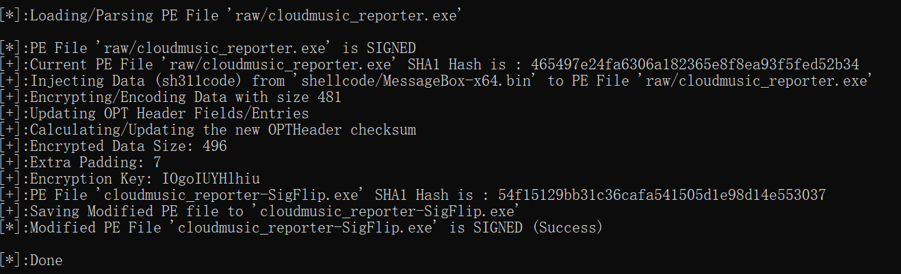
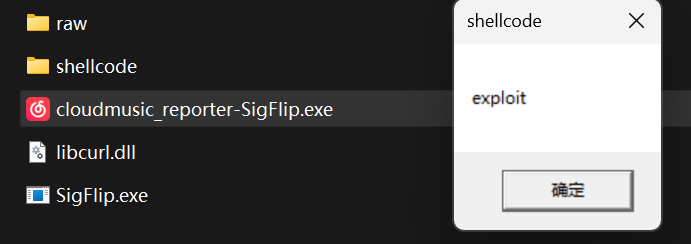
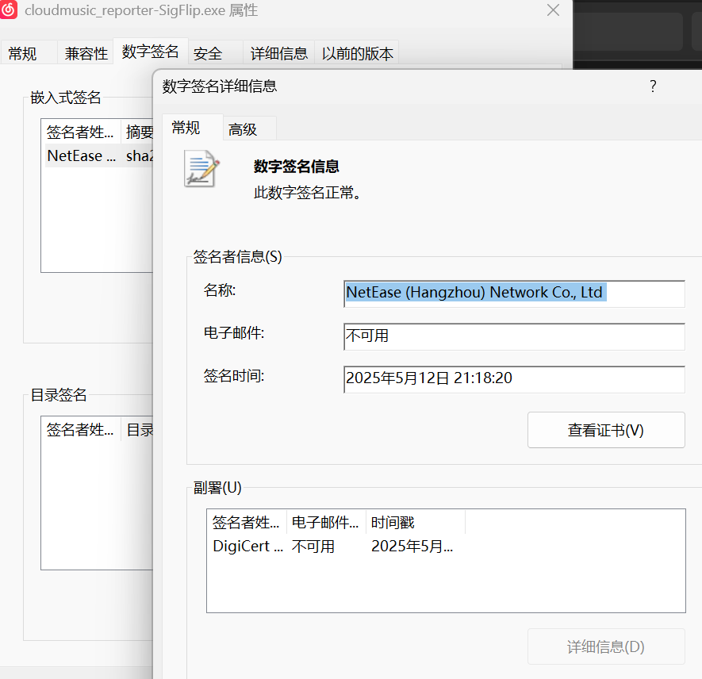

# SigFlip-DLLHijack

利用[SigFlip](https://github.com/med0x2e/SigFlip)将shellcode嵌入至白exe中，达到分离的目的，以减少DLL的静态特征。

## 使用方式

以`cloudmusic_reporter.exe`为例，使用示例的shellcode：

1. 编译黑DLL（libcurl.dll）

2. 嵌入shellcode至白exe并加密：

```shell
SigFlip.exe -i raw/cloudmusic_reporter.exe shellcode/MessageBox-x64.bin cloudmusic_reporter-SigFlip.exe IOgoIUYHlhiu
```



3. 放置同一目录并运行: 





## 参考项目

[https://github.com/med0x2e/SigFlip](https://github.com/med0x2e/SigFlip)

[https://github.com/Neo-Maoku/DllMainHijacking](https://github.com/Neo-Maoku/DllMainHijacking)

## 声明

**本项目仅限合法授权的安全测试与研究，严禁一切未授权行为。使用者须严格遵守相关法律法规，并自行承担全部风险及法律责任。**